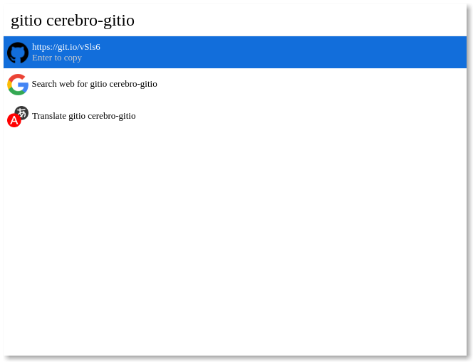

# Cerebro Git.io

> Shorten GitHub URLs with git.io

## Usage

In Cerebro, type `gitio QUERY` where `QUERY` is:

- An full GitHub URL like `https://github.com/lubien/cerebro-gitio`.
- An GitHub URL abbreviation like `lubien/cerebro-gitio`.

Wait a couple seconds for the result then:

- <kbd>cmd+c</kbd> to copy the result.
- <kbd>Enter</kbd> to copy the result and close Cerebro window.

## Related

- [Cerebro](http://github.com/KELiON/cerebro) – main repo for Cerebro app;
- [Git.io](https://git.io/) – the reason this exists.

## License

[MIT](LICENSE) © [Lubien](http://lubien.me)
